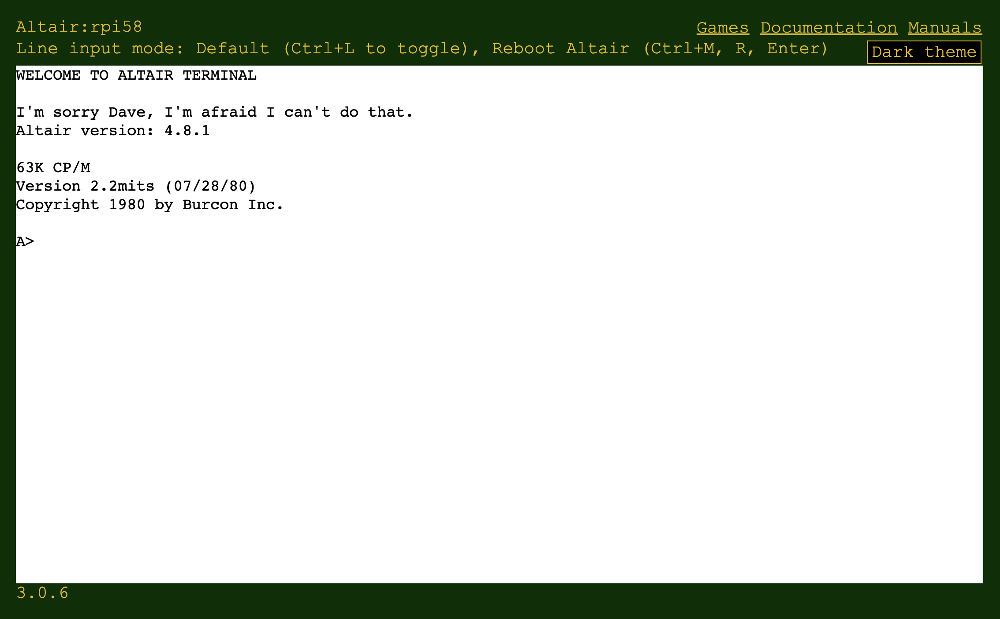

# Start the web terminal

The Altair web terminal is a remote terminal command prompt for the Altair emulator. The web terminal is a static web app and is hosted in your web browser and connects to the Altair emulator. When the web terminal connects, the Altair terminal reports the emulator and CP/M versions, and you can start to use the Altair.

Note, there are links on the web terminal to the retro games GitHub repo, the documentation, and user and programming manuals.

## Ten-minute video introduction

<iframe width="560" height="315" src="https://www.youtube.com/embed/uTBHzwm11xM" title="YouTube video player" frameborder="0" allow="accelerometer; autoplay; clipboard-write; encrypted-media; gyroscope; picture-in-picture" allowfullscreen></iframe>

