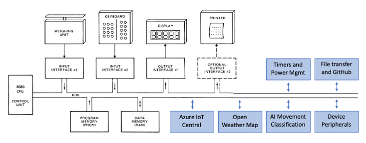

The Intel 8080 CPU can address up to 256 input ports and 256 output ports; allowing for virtually unlimited system expansion. Access to the ports is via the IN and OUT [Intel 8080 CPU instructions](https://github.com/AzureSphereCloudEnabledAltair8800/Altair8800.manuals/blob/master/8080asm.pdf){:target=_blank}, see page 38.

## Intel 8080 IO ports and peripherals



## Altair emulator software-enabled ports

The Altair emulator uses Intel 8080 IO ports to provide time services, random numbers, and access to cloud services.

- You can access Intel 8080 IO ports from BASIC, C, and Assembly programming languages, and directly using Intel 8080 opcodes. See [Using Intel 8080 Input Output ports](#using-intel-8080-input-output-ports).
- The Intel 8080 software-enabled IO ports are implemented in the [io_ports.c](https://github.com/gloveboxes/Altair8800.Emulator.UN-X/blob/main/src/io_ports.c){:target=_blank} file.
- You can extend the Altair 8800 by adding additional IO port functions, for example, integrating machine learning capabilities.

### Altair Emulator IO Port SDK

Sample code in the **AppSamples/sdk** folder demonstrates how to use the IO port features via a C language SDK. For details, see the [SDK samples](https://github.com/gloveboxes/Altair-8800-Emulator/tree/main/src/AppSamples/sdk){:target=_blank}. These examples are also helpful for LLM-assisted development and [Vibe-Coding](01-Vibe-Coding.md) for C, Microsoft Basic, and Assembly programming.

### Output ports

The following tables show output port numbers and port data values. Typically, calling an output port will load data to be read via an input port.

#### Utility output ports

| Port | Port data  | Loads |
|------|-------|:---------|
| 24   | 0-255 | Set timer 0 period high byte (milliseconds) |
| 25   | 0-255 | Set timer 0 period low byte (milliseconds) and start timer |
| 26   | 0-255 | Set timer 1 period high byte (milliseconds) |
| 27   | 0-255 | Set timer 1 period low byte (milliseconds) and start timer |
| 28   | 0-255 | Set timer 2 period high byte (milliseconds) |
| 29   | 0-255 | Set timer 2 period low byte (milliseconds) and start timer |
| 30   | 0-255 | Set timer period in seconds |
| 41   | 0     | System tick count |
| 42   | 0     | Current [UTC](https://en.wikipedia.org/wiki/Coordinated_Universal_Time){:target=_blank} date and time |
| 43   | 0     | Current local date and time |
| 44   | 0     | Generates a random number between -32000 and 32000 |
| 109  | 0     | set getfile (gf) custom endpoint url index to 0. Should be called before setting the custom endpoint url. |
| 110   | ASCII | Set getfile (gf) custom endpoint url |
| 111   | 0 | Load getfile (gf) custom endpoint url |
| 114   | ASCII | Set web request file name and call on NULL |

### Input ports

Typically, input ports will read data loaded by an output port.

| Port | Description |
|------|-------------|
| 24   | Query timer 0 milliseconds status. Enabled or expired (true or false) |
| 25   | Query timer 0 milliseconds status. Enabled or expired (true or false) |
| 26   | Query timer 1 milliseconds status. Enabled or expired (true or false) |
| 27   | Query timer 1 milliseconds status. Enabled or expired (true or false) |
| 28   | Query timer 2 milliseconds status. Enabled or expired (true or false) |
| 29   | Query timer 2 milliseconds status. Enabled or expired (true or false) |
| 30   | Query seconds timer status. Enabled or expired (true or false) |
| 31   | Query publish JSON pending status. Enabled or expired (true or false) |
| 32   | Query publish weather pending status. Enabled or expired (true or false) |
| 69  | Is network ready |
| 200  | Read loaded byte stream |
| 201  | Read webget file stream |
| 123  | Read OpenAi ChatGPT stream |
| 120  | Read OpenAI streaming status |
| 121  | Read OpenAI message |
| 122  | Read OpenAI finished status |

#### Weather ports

| Port | Port data | Loads |
|------|------|:---------|
| 34   | 0    | "Celsius" string literal |
| 34   | 1    | "Millibar" string literal |
| 34   | 2    | "Humidity %" string literal |
| 34   | 3    | "Wind km/h" string literal |
| 34   | 4    | "Wind degrees" string literal |
| 34   | 5    | "Observation" string literal |
| 35   | 0    | Temperature (Note 1) |
| 35   | 1    | Pressure (Note 1) |
| 35   | 2    | Relative humidity (Note 1) |
| 35   | 3    | Wind speed (Note 1) |
| 35   | 4    | Wind direction (Note 1) |
| 35   | 5    | Weather observation (Note 1) |

#### Location ports

| Port | Port data | Loads |
|------|------|:---------|
| 36   | 0    | "Latitude" string literal |
| 36   | 1    | "Longitude" string literal |
| 36   | 2    | "Longitude" string literal |
| 36   | 3    | "City" string literal |
| 37   | 0    | Latitude (Note 2) |
| 37   | 1    | Longitude (Note 2) |
| 37   | 2    | Country name (Note 2) |
| 37   | 3    | City name (Note 2) |

#### Pollution ports

| Port | Port data | Loads |
|------|------|:---------|
| 38   | 0    | "AQI(CAQI)" string literal |
| 38   | 1    | "CO" string literal |
| 38   | 2    | "NO" string literal |
| 38   | 3    | "NO2" string literal |
| 38   | 4    | "O3" string literal |
| 38   | 5    | "SO2" string literal |
| 38   | 6    | "NH3" string literal |
| 38   | 7    | "PM2.5" string literal |
| 38   | 8    | "PM1.0" string literal |
| 39   | 0    | Air quality index (Note 1) |
| 39   | 1    | Carbon monoxide level (Note 1) |
| 39   | 2    | Nitrogen monoxide level (Note 1) |
| 39   | 3    | Nitrogen dioxide level (Note 1) |
| 39   | 4    | Ozone level (Note 1) |
| 39   | 5    | Sulphur dioxide level (Note 1) |
| 39   | 6    | Ammonia level (Note 1) |
| 39   | 7    | Particulate matter 2.5 level (Note 1) |
| 39   | 8    | Particulate matter 1.0 level (Note 1) |

#### 8x8 LED Panels

- Pi Sense HAT
- Mikroe Retro 8800 Click

| Port | Port data  | Loads |
|------|-------|:---------|
| 65   | 0..8   | Power management LED brightness |

#### General ports

| Port | Port data  | Loads |
|------|-------|:---------|
| 70   | 0     | Loads Altair emulator version number |

#### Display 8x8 LED panel ports

| Port | Port data  | Loads |
|------|-------|:---------|
| 80   | 0, 1, 2 | 0 = Bus mode, 1 = Font mode, 2 = Bitmap mode
| 81   | 0, 1, 2 | 8x8 LED Panel RGB color. 0 = Red, 1 = Green, 2 = Blue |
| 82   | 0..255 | Set 8x8 LED Panel Red palette |
| 83   | 0..255 | Set 8x8 LED Panel Green palette |
| 84   | 0..255 | Set 8x8 LED Panel Blue palette |
| 85   | 0..255 | Display ASCII character |
| 90   | 0..255 | Set row 0 bitmap |
| 91   | 0..255 | Set row 1 bitmap |
| 92   | 0..255 | Set row 2 bitmap |
| 93   | 0..255 | Set row 3 bitmap |
| 94   | 0..255 | Set row 4 bitmap |
| 95   | 0..255 | Set row 5 bitmap |
| 96   | 0..255 | Set row 6 bitmap |
| 97   | 0..255 | Set row 7 bitmap |
| 98   | 0..63 | Turn pixel n on |
| 99   | 0..63 | Turn pixel n off |
| 100   | 0..63 | Pixel flip |
| 101   | 0 | Clear, turn all pixels off |
| 102   | 0 | Draw bitmap |

#### OpenAI ChatGPT

| Port | Port data  | Loads |
|------|-------|:---------|
| 120   | 0..255 | Set system Message |
| 121   | 0..255 | Set user message |
| 122   | 0..255 | Set assistant message|
| 123   | 0 | Clear all messages |
| 124   | 0 | Load ChatGPT stream |

#### Publish to Azure IoT ports

| Port | Port data  | Loads |
|------|-------|:---------|
| 31   | ASCII | Publish JSON to IoT Hub/Central (Max 256 characters) (Note 3) |
| 32   | 0 | Publish weather and pollution data to IoT Hub/Central (Note 3) |

#### Azure Sphere specific ports

| Port | Port data  | Loads |
|------|-------|:---------|
| 60   | 1 or 0 | Turn Red LED on or off |
| 61   | 1 or 0 | Turn Green LED on or off |
| 62   | 1 or 0 | Turn Blue LED on or off |
| 63   | 0      | Loads onboard temperature |
| 63   | 1      | Loads onboard pressure |
| 63   | 2      | Loads onboard light sensor |
| 64   | 0      | Loads accelerometer X axis |
| 64   | 1      | Loads accelerometer Y axis |
| 64   | 2      | Loads accelerometer Z axis |
| 64   | 3      | Start the accelerometer timer|
| 64   | 4      | Stop the accelerometer timer |
| 64   | 5      | One-off accelerometer reading |
| 64   | 6      | Calibrate accelerometer for angular rate|
| 64   | 7      | Load accelerometer for angular rate |
| 64   | 8      | Get latest movement inference result |
| 66   | 0      | Power management disable |
| 66   | 1      | Power management enable |
| 66   | 2      | Power management sleep |
| 67   | 1..255 | Power management wake from sleep (seconds) |
| 71   | 0      | Get Azure Sphere OS version number |
| 72   | 0      | Get first 8 characters of Azure Sphere device ID |

**Notes.**

1. Requires an Open Weather Map API Key, and an active internet connection.
2. Requires an active internet connection to call the [geojs.io](https://get.geojs.io/v1/ip/geo.json){:target=_blank} web service.
3. Requires an active internet connection and a free or paid tier or Azure IoT Central.

## Using Intel 8080 Input Output ports

The following code snippets use the Intel 8080 IO ports. The code samples included on the CP/M boot disk expand on these snippets.

### Assembler access to Intel 8080 IO Ports

The following assembly code demonstrates the use of the Intel 8080 IO port 30 timer. The code sets a 2-second delay, and then waits for the timer to expire. This is a snippet of the **SLEEP.ASM** sample included on drive B: of the Altair emulator.

```asm
      ORG 0100H   ;CP/M base of TPA (transient program area)
      MVI A,2     ;Move 2 to the accumulator to set a 2 second delay
      OUT 30      ;Start timer
LOOP: IN 30       ;Get delay timer state into the accumulator
      CPI 00H     ;If accumulator equal to 0 then timer has expired
      JZ BACK     ;Jump on zero
      JMP LOOP
BACK: RET
```

### BSD C access to Intel 8080 IO Ports

The following C code demonstrates the use of the Intel 8080 IO port 30 timer. The code sets a 1-second delay, and then waits for the timer to expire. This is a snippet of the **HW.C** sample included on drive B: of the Altair emulator.

```c
outp(30,1);      /* Enable delay for 1 second */
while(inp(30));  /* Wait for delay to expire */
```

### BASIC access to Intel 8080 IO Ports

The following BASIC code demonstrates the use of the Intel 8080 IO port 30 timer. The code sets a 1-second delay, and then waits for the timer to expire. This is a snippet of the **COUNT.BAS** sample included on drive A: of the Altair emulator.

#### Delay IO ports

```basic
900 REM This sleep subroutine sleeps or delays for 1 second
1000 OUT 30, 1
1100 WAIT 30, 1, 1
1200 RETURN
```

#### Weather IO ports

The following BASIC code demonstrates the use of Intel 8080 output port 35 to load the current temperature, and the input port to read the temperature. This is a snippet of the **WEATHER.BAS** sample included on drive A: of the Altair emulator.

```BASIC
500 PORT = 34 : REM Set the output port number
510 PDATA = 0 : REM Set the port data value to 0 for temperature
520 GOSUB 4800 : REM Loads the temperature and then reads the temperature string
530 PRINT RSTRING$
540 END

4800 REM SUBROUTINE READS STRING DATA FROM PORT UNTIL NULL CHARACTER
4900 OUT PORT, PDATA
5000 RSTRING$ = ""
5100 C=INP(200) : REM Read the temperature character by character until NULL returned
5200 IF C = 0 THEN RETURN
5300 RSTRING$ = RSTRING$ + CHR$(C)
5400 GOTO 5100
```

#### Font support

The following example shows how to use the Intel 8080 IO ports to display characters on the Pi Sense HAT or Retro Click 8x8 LED panels. To understand IO ports, refer to the [io_ports.c](https://github.com/gloveboxes/Altair8800.Emulator.UN-X/blob/main/src/io_ports.c){:target=_blank} source code. This example is included on drive A: in a file named **FONT.BAS**.

```basic
100 REM 8x8 LED Panel Demo
200 OUT 80,1 : REM Flip the 8x8 LED panel to FONT mode
300 FOR J = 1 TO 10
400 FOR I = 33 TO 122
500 OUT 81, I MOD 3 : REM Cycle font color
600 OUT 85, I : REM Display character on the 8x8 LED panel
700 PRINT CHR$(I)
800 OUT 29, 250 : WAIT 29, 1, 1 : REM Pause for 250 milliseconds
900 NEXT I
1000 NEXT J
1100 OUT 80,0
```

#### Azure Sphere Blinky

The following example shows how to use the Intel 8080 IO ports to blink LEDs on an Azure Sphere. To understand how IO ports are implemented, refer to the [io_ports.c](https://github.com/gloveboxes/Altair8800.Emulator.UN-X/blob/main/src/io_ports.c){:target=_blank} source code.

```basic
5 OUT 80, 1 : REM switch display to font mode
10 WHILE 1=1 : REM Loop forever
20 OUT 60, 1 : REM switch on the red LED
30 OUT 29, 250 : WAIT 29, 1, 1 : REM delay 250 milliseconds
40 OUT 61, 1 : REM switch on the green LED
50 OUT 29, 250 : WAIT 29, 1, 1 : REM delay 250 milliseconds
60 OUT 62, 1 : REM switch on the blue LED
70 OUT 29, 250 : WAIT 29, 1, 1 : REM delay 250 milliseconds
80 OUT 60, 0 : OUT 61, 0 : OUT 62, 0 : REM Turn off all LEDs
85 OUT 29, 250 : WAIT 29, 1, 1 : REM delay 250 milliseconds
90 WEND
100 OUT 80, 0 : REM switch display to bus mode
```
